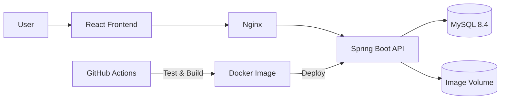
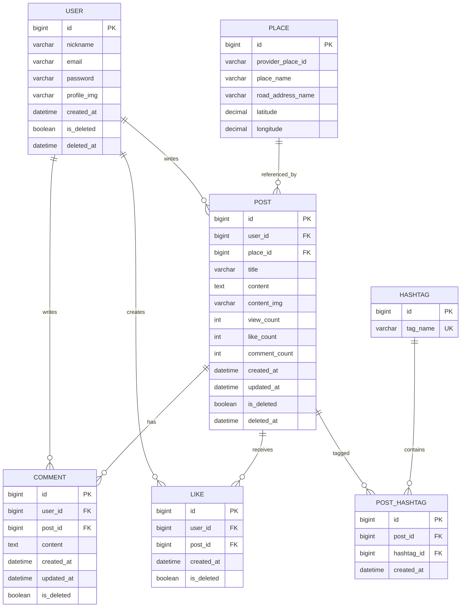

# FOCAL Backend

사진과 장소, 해시태그를 함께 기록하고 공유하는 커뮤니티 서비스의 백엔드입니다. 게시글·댓글·좋아요 기능뿐 아니라 해시태그와 기간을 조합한 검색, JWT 인증, 이미지 업로드를 제공합니다.

> **대표 성과** — 게시글 365만 건 환경에서 인기 해시태그의 6개월 검색 API 평균 응답 시간을 **3.15초에서 54ms로 단축**했습니다. 약 58배 빨라졌으며, 응답 시간은 약 98.3% 감소했습니다.

## 프로젝트 정보

| 항목 | 내용                                                                               |
| --- |------------------------------------------------------------------------------------|
| 개발 기간 | 2026.06.17 ~ 2026.08.09                                                            |
| Backend | [KTB4_Finn_Personal_BE](https://github.com/100-hours-a-week/KTB4_Finn_Personal_BE) |
| Frontend | [KTB4_Finn_Personal_FE](https://github.com/100-hours-a-week/KTB4_Finn_Personal_FE) |
| API 명세 | [docs/API.md](docs/API.md)                                                         |
| 성능 개선 기록 | [docs/hashtag-search-performance.md](docs/hashtag-search-performance.md)           |

## 기술 스택

| 영역 | 기술 | 사용 목적 |
| --- | --- | --- |
| Language | Java 25 | 백엔드 애플리케이션 구현 |
| Framework | Spring Boot 4.1, Spring MVC | REST API와 애플리케이션 구성 |
| Data | Spring Data JPA, QueryDSL | 도메인 영속화와 동적 검색 쿼리 작성 |
| Security | Spring Security, JWT, BCrypt | Stateless 인증, 인가, 비밀번호 암호화 |
| Database | MySQL 8.4 | 운영 데이터 저장과 인덱스 기반 검색 |
| Test | JUnit 5, Mockito, JaCoCo | 서비스·시드 데이터 검증과 커버리지 확인 |
| Infra | Docker, Docker Compose | 동일한 실행 환경과 서비스 구성 관리 |
| CI/CD | GitHub Actions, Docker Hub | 테스트·빌드, 멀티 아키텍처 이미지 배포 자동화 |

## 아키텍처



- Access Token은 응답 본문으로 전달하고, Refresh Token은 `HttpOnly` 쿠키와 DB에 저장합니다.
- 게시글 목록에서 작성자와 장소를 Fetch Join하고, 좋아요 여부와 해시태그는 일괄 조회해 반복 쿼리를 줄였습니다.
- GitHub Actions가 MySQL 서비스 컨테이너에서 테스트와 빌드를 수행한 뒤 `amd64`, `arm64` 이미지를 배포합니다.

## 주요 기능

| 도메인 | 기능 | 구현 포인트 |
| --- | --- | --- |
| 회원·인증 | 회원가입, 로그인, 토큰 재발급, 로그아웃, 회원 수정·탈퇴 | BCrypt 암호화, JWT 필터, Refresh Token 회전·폐기, 소프트 삭제 |
| 게시글 | 작성, 상세 조회, 수정·삭제, 최신·인기·내 글 조회 | 작성자 권한 검증, 조회·댓글·좋아요 집계 컬럼, 장소 Fetch Join |
| 댓글 | 작성, 목록 조회, 수정·삭제 | 작성자 검증, 소프트 삭제, 게시글 댓글 수 동기화 |
| 좋아요 | 좋아요 등록·취소·복구 | `(user_id, post_id)` 유니크 제약, 목록의 사용자별 좋아요 일괄 조회 |
| 해시태그 | 최대 5개 등록·수정, 태그·기간 검색 | 태그 정규화, 연결 테이블, 복합 인덱스와 생성일 반정규화 |
| 장소 | 게시글 장소 저장·응답 | 외부 장소 ID 보관, 위·경도 범위 검증과 소수점 6자리 저장 |
| 이미지 | 프로필·게시글 이미지 업로드 | 도메인별 저장 경로 분리, 15MB 요청 제한 |
| 공통 | 검증과 예외 처리 | `ApiResponse<T>` 공통 응답, 전역 예외 처리, 인증·인가 응답 분리 |

## API 요약

성공 응답은 기본적으로 `{ "message": string, "data": T }` 형태입니다. `인증 필요` API는 `Authorization: Bearer <access-token>` 헤더가 필요합니다.

### 회원·인증

| Method | Endpoint | 설명 | 인증 |
| --- | --- | --- | --- |
| `POST` | `/users/signup` | 회원가입 | 불필요 |
| `POST` | `/users/login` | 로그인 | 불필요 |
| `POST` | `/users/token/refresh` | Access Token 재발급 | Refresh Token 쿠키 |
| `POST` | `/users/logout` | 로그아웃 | 필요 |
| `GET` | `/users/me` | 내 정보 조회 | 필요 |
| `PATCH` | `/users/me` | 내 정보 수정 | 필요 |
| `PATCH` | `/users/me/password` | 비밀번호 변경 | 필요 |
| `DELETE` | `/users/me` | 회원 탈퇴 | 필요 |

### 게시글·댓글·좋아요

| Method | Endpoint | 설명 | 인증 |
| --- | --- | --- | --- |
| `POST` | `/posts` | 게시글 작성 | 필요 |
| `GET` | `/posts/{postId}` | 게시글 상세 조회 | 필요 |
| `GET` | `/posts?filter=RECENT\|POPULAR\|MINE` | 게시글 목록 조회 | 필요 |
| `GET` | `/posts/search` | 해시태그·기간 검색 | 필요 |
| `PATCH` | `/posts/{postId}` | 게시글 수정 | 필요 |
| `DELETE` | `/posts/{postId}` | 게시글 삭제 | 필요 |
| `POST` | `/posts/{postId}/comments` | 댓글 작성 | 필요 |
| `GET` | `/posts/{postId}/comments` | 댓글 목록 조회 | 필요 |
| `PATCH` | `/comments/{commentId}` | 댓글 수정 | 필요 |
| `DELETE` | `/comments/{commentId}` | 댓글 삭제 | 필요 |
| `POST` | `/posts/{postId}/like` | 좋아요 등록·복구 | 필요 |
| `DELETE` | `/posts/{postId}/like` | 좋아요 취소 | 필요 |

### 이미지

| Method | Endpoint | 설명 | 인증 |
| --- | --- | --- | --- |
| `POST` | `/images/users` | 프로필 이미지 업로드 | 불필요 |
| `POST` | `/images/posts` | 게시글 이미지 업로드 | 불필요 |

요청 필드, 검증 규칙, 응답 예시는 [상세 API 문서](docs/API.md)에서 확인할 수 있습니다.

## DB 설계

### 요구사항에서 도출한 설계

- 회원, 게시글, 댓글은 삭제 이력을 유지하고 연관 데이터 손실을 막기 위해 소프트 삭제합니다.
- 게시글과 해시태그의 다대다 관계는 `PostHashTag` 연결 엔티티로 해소하고 중복 연결을 유니크 제약으로 차단합니다.
- 목록 조회 때마다 전체 댓글과 좋아요를 집계하지 않도록 게시글에 `commentCount`, `likeCount`, `viewCount`를 저장합니다.
- 해시태그 검색에서 연결 테이블만으로 기간 필터와 정렬을 처리하도록 `PostHashTag.createdAt`을 반정규화합니다.
- H2에서 MySQL로 전환하면서 MySQL이 별도 Sequence 객체를 지원하지 않는 점을 고려해 기본키 생성 전략을 `IDENTITY`로 통일했습니다. 키는 INSERT 시점에 생성되므로 Sequence의 allocation 최적화는 사용할 수 없다는 제약을 수용했습니다.

### ERD



`RefreshToken`은 사용자 연관관계를 직접 매핑하지 않고 `userId`, 토큰, 만료 시각을 저장합니다. 로그아웃과 회원 탈퇴 시 해당 토큰을 제거합니다.

### 인덱스

| 대상 조회 | 인덱스·제약 | 설계 이유 |
| --- | --- | --- |
| 최신 게시글 | `(is_deleted, created_at DESC)` | 삭제 여부 동등 조건 뒤에서 생성일 역순 탐색 |
| 인기 게시글 | `(is_deleted, like_count DESC)` | 삭제되지 않은 게시글을 좋아요 수 기준으로 정렬 |
| 해시태그·기간 검색 | `(hashtag_id, created_at, post_id)` | 태그 동등 조건, 날짜 범위·정렬, 게시글 조인 키를 한 인덱스에 배치 |
| 중복 해시태그 방지 | `UNIQUE(post_id, hashtag_id)` | 한 게시글에 같은 태그가 중복 연결되는 상황 차단 |
| 중복 좋아요 방지 | `UNIQUE(user_id, post_id)` | 한 사용자가 같은 게시글에 여러 Like 행을 만드는 상황 차단 |

## 해시태그 검색 성능 개선

초기 검색은 태그 선택도에 따라 `posts` 전체 탐색 또는 `post_hash_tags` 조회 후 대량 PK Lookup이 발생했습니다. 연결 테이블에 생성일을 반정규화하고 복합 인덱스를 추가했지만, QueryDSL의 `post.id DESC`가 조인된 `posts.id` 정렬로 번역되면서 후보 72.4만 건을 조인·정렬하는 문제가 남았습니다.

안정적인 동률 정렬보다 현재 요구사항의 조회 성능을 우선해 보조 정렬을 제거했습니다. 최종 쿼리는 복합 인덱스를 역방향 탐색해 먼저 10건을 정하고, 선택된 게시글과 작성자만 PK로 조회합니다.

| 항목 | 개선 전 | 개선 후 |
| --- | ---: | ---: |
| 데이터 | 게시글 365만 건 | 게시글 365만 건 |
| 인기 태그 6개월 API 평균 | 3.15s | 54ms |
| 실행 흐름 | 후보 72.4만 건 조인·정렬 | 인덱스에서 10건 선택 후 PK 조회 |
| 결과 | 불필요한 조인·정렬 발생 | 약 58배 개선 |

> 서로 다른 데이터 규모에서 얻은 결과는 증가 추세 분석에만 사용하고, 개선율은 동일한 365만 건 환경의 반복 측정 평균끼리 비교했습니다.

가설, 편향 시드 데이터, 실행 계획과 ORM 문제 분석은 [해시태그·기간 검색 성능 개선 기록](docs/hashtag-search-performance.md)에 정리했습니다.

## 실행 방법

### 요구 환경

- Java 25
- MySQL 8.4
- Docker 사용 시 Docker Engine과 Docker Compose

### 환경 변수

| 변수 | 설명 | 로컬 기본값 |
| --- | --- | --- |
| `SPRING_DATASOURCE_URL` | MySQL JDBC URL | `jdbc:mysql://localhost:3306/focal` |
| `SPRING_DATASOURCE_USERNAME` | DB 사용자 | `focal_app` |
| `SPRING_DATASOURCE_PASSWORD` | DB 비밀번호 | 없음 |
| `JWT_SECRET_KEY` | JWT 서명 키 | 반드시 별도 설정 |
| `JWT_ACCESS_TOKEN_EXP_SECONDS` | Access Token 만료 시간 | `3600` |
| `JWT_REFRESH_TOKEN_EXP_SECONDS` | Refresh Token 만료 시간 | `12096000` |
| `FILE_UPLOAD_DIR` | 이미지 저장 경로 | `uploads` |

스키마 자동 생성이 아니라 `spring.jpa.hibernate.ddl-auto=validate`를 사용하므로, 실행 전에 현재 엔티티와 일치하는 MySQL 스키마가 준비되어 있어야 합니다.

```bash
export SPRING_DATASOURCE_PASSWORD='your-password'
export JWT_SECRET_KEY='replace-with-a-secret-key-at-least-32-bytes'
./gradlew bootRun
```

테스트와 빌드는 다음 명령으로 실행합니다.

```bash
./gradlew clean build
```

Docker 이미지는 멀티 스테이지 Dockerfile로 생성할 수 있습니다.

```bash
docker build -t focal-be .
```

## 트러블슈팅

### JPA 연관관계 정렬과 복합 인덱스

`postHashTag.post.id` 정렬이 SQL에서 `posts.id` 정렬로 변환되어 인덱스 정렬을 끝까지 활용하지 못했습니다. 실행 SQL과 `EXPLAIN ANALYZE`를 함께 확인해 ORM 코드가 의도한 SQL을 생성하는지 검증했고, 현재 요구사항에서는 생성일 단독 정렬을 선택했습니다.

### 게시글 목록의 좋아요 상태 N회 조회

게시글마다 로그인 사용자의 좋아요 여부를 확인하면 목록 크기만큼 쿼리가 증가합니다. 게시글 ID 목록으로 좋아요를 한 번에 조회한 뒤 좋아요한 게시글 ID Set으로 변환해 응답을 조립하도록 개선했습니다.

### 프론트엔드와 위치 필드 계약

위치 필드 이름 불일치로 값이 전달되지 않는 문제를 양쪽 DTO 계약을 맞춰 해결했습니다. 위도와 경도는 각각 `DECIMAL(8, 6)`, `DECIMAL(9, 6)` 범위로 조정해 유효 범위와 필요한 정밀도를 함께 만족시켰습니다.

## 회고와 다음 개선

- 단순히 인덱스를 추가하는 것보다 데이터 분포와 실제 ORM 생성 SQL이 실행 계획을 결정한다는 점을 확인했습니다.
- 동일 시각에 생성된 게시글의 순서는 현재 보장하지 않습니다. 안정적인 정렬이 필요하면 `post_id`를 읽기 전용 스칼라 필드로 함께 매핑해 연결 테이블의 키로 정렬할 예정입니다.
- 게시글 목록은 현재 최대 10건 고정 조회입니다. 데이터 탐색 범위를 확장할 때는 `(createdAt, id)` 기반 커서 페이지네이션을 도입할 예정입니다.
- 이미지가 로컬 볼륨에 의존하므로 오브젝트 스토리지와 CDN으로 이전할 필요가 있습니다.
- 테스트는 회원 서비스와 대용량 시드 생성 검증에 집중되어 있습니다. 게시글 검색, 인증 필터, 동시 좋아요 요청에 대한 통합 테스트를 보강할 예정입니다.
